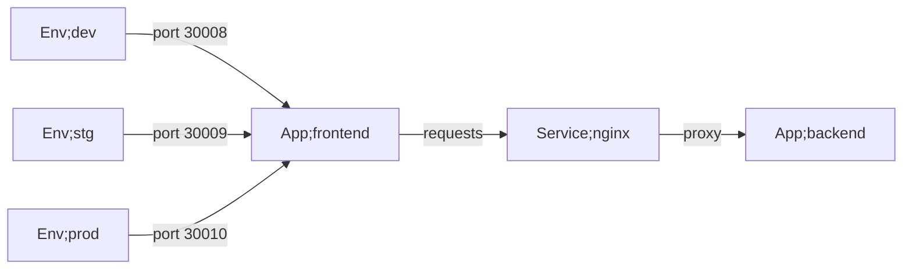
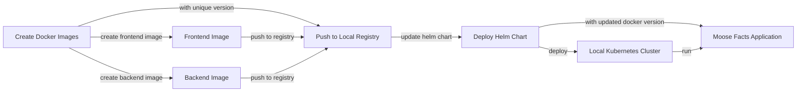

## Description
This repo attempts to setup a kubernetes cluster, deploy an application comprised of a backend (python flask) and frontend (nginx) service to said cluster using a combination of CI, helm and github actions.

Everything runs locally on the host machine.

## Architecture
### Dataflow


### Deployment flow


## Hardware
The environment is designed for use on a raspberry pi 5 running the raspbian lite arm64 OS.
The host name of the system is control-node. (Used to connect to the cluster from outside the hosts local network)

## Usage
- Fork the [tech-challenge](https://github.com/peader/tech-challenge) repo.
- Run the setup_environment.sh script at the root of the repo.
- It will fail the first time when trying to install the k3s software (this is because the cgroup settings need to be read at machine startup to take effect). Restart the host and run again.
- Follow the manual instructions that are printed to the terminal.
    - 1. Copy the content of /etc/rancher/k3s/k3s.yaml
    - 2. Replace the <your-kube-config> string in the secrets/my-custom.secrets file with the copied content
    - 3. Restart the raspberry pi
- Run the command:
    ``` bash
    act --job docker --secret-file=secrets/my-custom.secrets
    ```
- Open the host file on your system (on windows this is located at C:\Windows\System32\drivers\etc\hosts) and add the following to the file (The ip of the host running the ingress is static and just happens to be our pi host):
```
<ip-of-your-raspberry-pi>	   dev.moosefacts.com
<ip-of-your-raspberry-pi>	   stg.moosefacts.com
<ip-of-your-raspberry-pi>	   prod.moosefacts.com
```
- Run the command:
    ``` bash
    act --job deployment-dev --secret-file=secrets/my-custom.secrets
    ```
- Open a browser and navigate to dev.moosefacts.com. You should see the moose facts website.
- Deploy the staging and production environment with the following commands:
    ``` bash
    act --job deployment-stg --secret-file=secrets/my-custom.secrets
    act --job deployment-prod --secret-file=secrets/my-custom.secrets
    ```
- Navigate to http://control-node:3001 (this is our kuma uptime monitoring service).
- Input your new credentials and login.
- Add three new dashboards. One for dev, stg and production with the urls:
    - dev.moosefacts.com
    - stg.moosefacts.com
    - prod.moosefacts.com

## Making changes
- Simply change either the application/backend/server.py file, for example add a new endpoint or modify an existing endpoint, or modify the html file at application/frontend/index.html.
- Commit the changes (needed for updating the image revision).
- Run the commands:
    ``` bash
    act --job docker --secret-file=secrets/my-custom.secrets
    act --job deployment-dev --secret-file=secrets/my-custom.secrets
    ```
You should see the changes reflected in the moose facts website at url dev.moosefacts.com

## Troubleshooting
- If the site is not acting as expected run the command
``` bash
kubectl get pods
```
to get the status of the pods created by the deployment.
- If you need further info on a particular pod run the command:
``` bash
kubectl logs -l app=<frontend or backend>-<environment> --all-containers=true
```

## Other useful commands
```
export KUBECONFIG=/etc/rancher/k3s/k3s.yaml
helm uninstall moose-facts-<environment>
```


